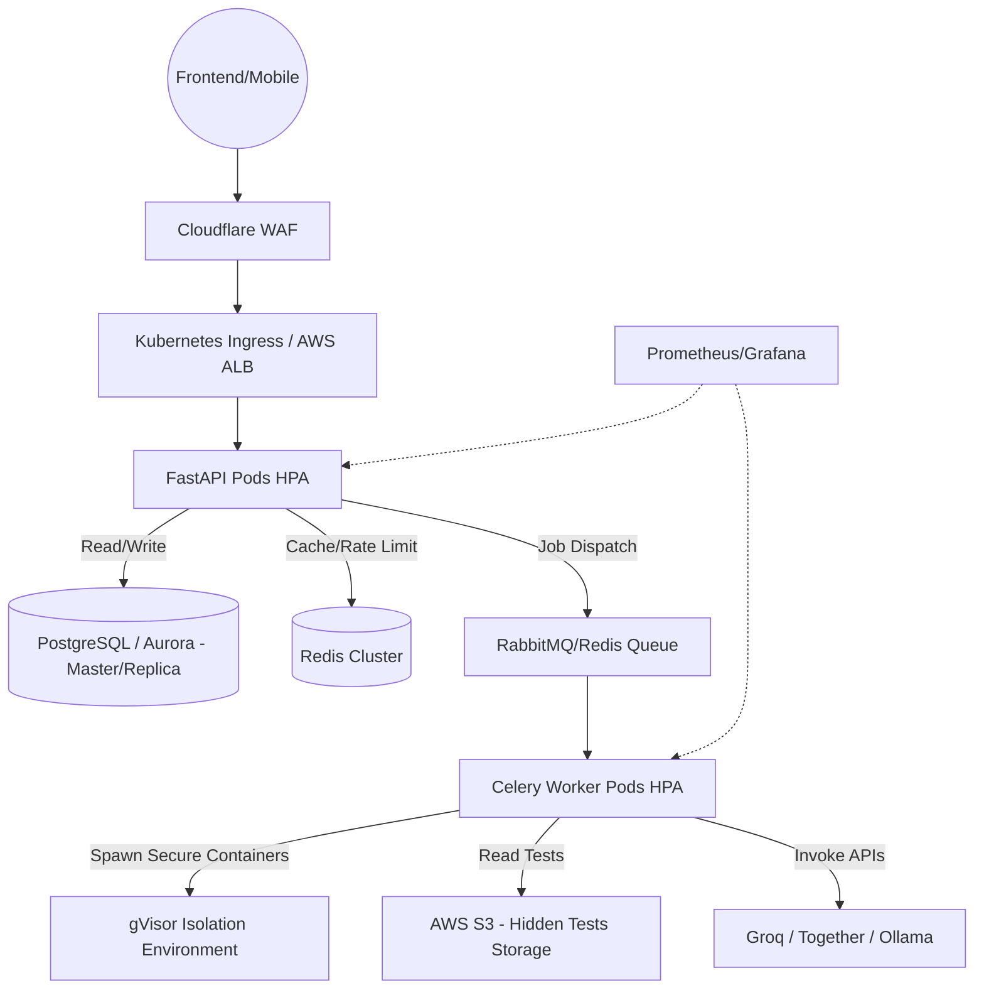

# Production Deployment Guide

## Architecture Topology
Building a robust system that can withstand internet-scale code submissions.



## Step 1: Local Development
Spin up the infrastructure locally to test:
`docker-compose up --build -d`

This powers:
- FastAPI API (Port 8000)
- PostgreSQL Database
- Redis (Broker & Cache)
- Celery Task Workers
- Prometheus Metrics Engine

## Step 2: Kubernetes Migration (EKS/GKE)
1. **Worker Pools**: Tag specific nodes for `Sandbox Execution`. Do not run other critical services (DBs, APIs) on the same node pool that executes user code.
2. **gVisor via RuntimeClass**:
   Patch the worker pods namespace to use `runtimeClassName: gvisor`.
   ```yaml
   apiVersion: node.k8s.io/v1
   kind: RuntimeClass
   metadata:
     name: gvisor
   handler: runsc
   ```
3. **Database Scaling**: Set up PgBouncer connection pooling to avoid exhausting Postgres connection tracking while FastAPI horizontal scales under heavy load.
